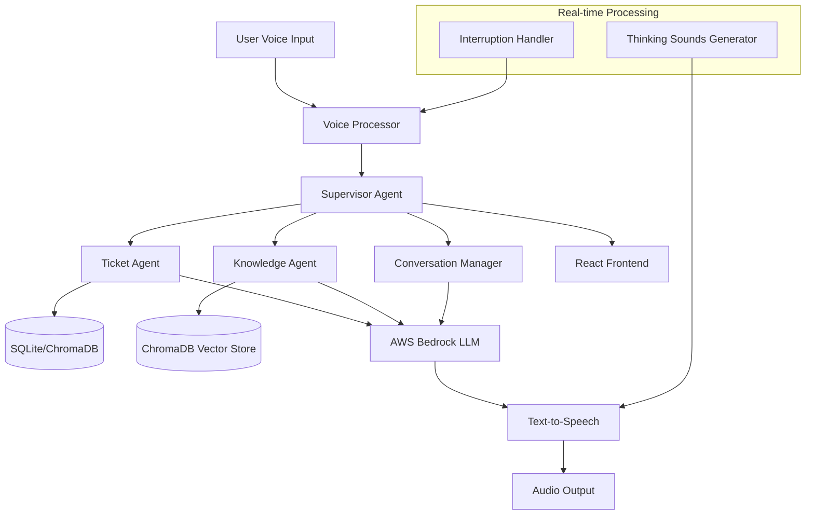

# Design Document

## Overview

The Agentic Voice Assistant is a real-time conversational AI system built with a multi-agent architecture. The system processes voice input through specialized agents and provides human-like responses with natural conversation flow. The architecture leverages AWS Bedrock for LLM capabilities, STRAND Agent SDK for agent orchestration, and maintains real-time performance with interruption handling.

## Architecture

### High-Level Architecture



### Component Architecture

The system follows a microservices-like architecture with the following main components:

1. **Voice Processing Layer**: Handles real-time speech-to-text and text-to-speech
2. **Agent Orchestration Layer**: STRAND-based multi-agent system
3. **Data Access Layer**: ChromaDB for vectors, SQLite for structured ticket data
4. **Conversation Management Layer**: Maintains context and natural flow
5. **Frontend Layer**: React-based real-time UI

## Components and Interfaces

### 1. Voice Processor Component

**Purpose**: Manages real-time voice input/output with interruption capabilities

**Key Classes**:
- `VoiceInputHandler`: Extends your existing speechToText.py functionality
- `VoiceOutputHandler`: Extends your existing textToSpeech.py functionality  
- `InterruptionDetector`: Monitors for meaningful voice input during playback

**Interfaces**:
```python
class VoiceProcessor:
    async def start_listening(self) -> AsyncGenerator[str, None]
    async def speak_text(self, text: str, interruptible: bool = True) -> bool
    async def play_thinking_sound(self) -> None
    def is_speaking(self) -> bool
    def stop_speaking(self) -> None
```

**Integration with Existing Code**:
- Wraps your `MyEventHandler` class for continuous transcription
- Extends your `use_polly()` function with interruption detection
- Maintains the same AWS Transcribe/Polly configuration

### 2. Supervisor Agent

**Purpose**: Main orchestrating agent that routes requests and manages conversation flow

**Key Responsibilities**:
- Intent analysis using AWS Bedrock
- Agent routing decisions
- Conversation context management
- Response coordination

**Interfaces**:
```python
class SupervisorAgent:
    async def process_query(self, query: str, context: ConversationContext) -> AgentResponse
    async def route_to_agents(self, intent: Intent) -> List[AgentTask]
    async def synthesize_responses(self, agent_results: List[AgentResult]) -> str
    async def should_escalate(self, confidence: float, context: ConversationContext) -> bool
```

### 3. Ticket Agent

**Purpose**: Specialized agent for retrieving and processing support ticket data

**Data Storage Strategy**:
- **Recommendation**: Use SQLite for structured ticket data (CSV import)
- **Rationale**: Tickets have structured fields (ID, status, priority, etc.) that benefit from relational queries
- **Vector Integration**: Store ticket summaries/descriptions in ChromaDB for semantic search

**Interfaces**:
```python
class TicketAgent:
    async def search_tickets(self, query: str, filters: Dict) -> List[Ticket]
    async def get_ticket_details(self, ticket_id: str) -> TicketDetails
    async def analyze_ticket_patterns(self, criteria: SearchCriteria) -> AnalysisResult
```

### 4. Knowledge Agent

**Purpose**: Handles RAG operations on PDF knowledge base using ChromaDB

**Data Storage Strategy**:
- **PDF Documents**: Chunked and stored as embeddings in ChromaDB
- **Metadata**: Document source, page numbers, section headers
- **Embedding Model**: AWS Bedrock Titan Embeddings

**Interfaces**:
```python
class KnowledgeAgent:
    async def semantic_search(self, query: str, top_k: int = 5) -> List[KnowledgeChunk]
    async def get_contextual_info(self, topic: str) -> ContextualResponse
    async def verify_information(self, claim: str) -> VerificationResult
```

### 5. Conversation Manager

**Purpose**: Maintains natural conversation flow with human-like responses

**Key Features**:
- Greeting management
- Thinking sounds during processing
- Context-aware responses
- Natural conversation transitions

**Interfaces**:
```python
class ConversationManager:
    async def generate_greeting(self) -> str
    async def get_thinking_phrase(self) -> str
    async def format_response(self, data: Any, context: ConversationContext) -> str
    async def handle_interruption(self, new_query: str) -> InterruptionResponse
```

## Data Models

### Core Data Structures

```python
@dataclass
class ConversationContext:
    session_id: str
    user_id: Optional[str]
    conversation_history: List[Message]
    current_topic: Optional[str]
    last_agent_used: Optional[str]
    confidence_scores: List[float]

@dataclass
class AgentResponse:
    agent_name: str
    data: Any
    confidence: float
    processing_time: float
    requires_escalation: bool

@dataclass
class VoiceInteraction:
    transcript: str
    confidence: float
    timestamp: datetime
    is_interruption: bool
    word_count: int
```

### Database Schema

**SQLite Schema (Tickets)**:
```sql
CREATE TABLE tickets (
    id TEXT PRIMARY KEY,
    title TEXT NOT NULL,
    description TEXT,
    status TEXT,
    priority TEXT,
    created_date DATETIME,
    updated_date DATETIME,
    category TEXT,
    assigned_to TEXT
);

CREATE TABLE ticket_interactions (
    id INTEGER PRIMARY KEY,
    ticket_id TEXT,
    interaction_type TEXT,
    content TEXT,
    timestamp DATETIME,
    FOREIGN KEY (ticket_id) REFERENCES tickets(id)
);
```

**ChromaDB Collections**:
- `knowledge_base`: PDF document chunks with metadata
- `ticket_summaries`: Semantic representations of ticket content

## Error Handling

### Voice Processing Errors
- **AWS Service Failures**: Graceful fallback with user notification
- **Audio Device Issues**: Clear error messages and retry mechanisms
- **Network Interruptions**: Queue management for offline scenarios

### Agent Processing Errors
- **LLM API Failures**: Fallback responses and retry logic
- **Database Connection Issues**: Cached responses and error recovery
- **Low Confidence Responses**: Automatic escalation triggers

### Real-time Processing Errors
- **Interruption Detection Failures**: Continue with current response
- **Context Loss**: Conversation recovery mechanisms
- **Performance Degradation**: Adaptive quality adjustments

## Testing Strategy

### Unit Testing
- Voice processing components with mock audio streams
- Individual agent logic with test data
- Database operations with test fixtures
- LLM integration with mock responses

### Integration Testing
- End-to-end voice conversation flows
- Multi-agent coordination scenarios
- Real-time interruption handling
- AWS service integration tests

### Performance Testing
- Response time measurements (target: <500ms)
- Concurrent user handling
- Memory usage during long conversations
- Audio quality under various conditions

### User Experience Testing
- Natural conversation flow validation
- Interruption accuracy testing
- Voice quality assessment
- UI responsiveness verification

## Implementation Considerations

### macOS Development Environment
- **Audio System**: Core Audio framework integration via sounddevice library
- **Dependencies**: PortAudio installation via Homebrew (`brew install portaudio`)
- **Permissions**: Microphone access permissions in System Preferences > Security & Privacy
- **Python Environment**: Use Python 3.9+ with proper virtual environment setup
- **Audio Devices**: Automatic detection and handling of default input/output devices
- **Threading**: Proper async handling for macOS Core Audio threading model

### AWS Integration
- **Authentication**: Use existing AWS SSO setup with environment variables
- **Region**: us-east-1 for all services
- **Services**: Bedrock (Claude/GPT models), Transcribe, Polly
- **Cost Optimization**: Efficient API usage patterns

### Real-time Performance
- **Async Architecture**: Full async/await implementation
- **Connection Pooling**: Reuse AWS service connections
- **Caching**: Intelligent response caching
- **Stream Processing**: Continuous audio stream handling

### Scalability Considerations
- **Agent Pool Management**: Dynamic agent scaling
- **Database Optimization**: Indexed queries and connection pooling
- **Memory Management**: Efficient conversation context storage
- **Load Balancing**: Future multi-instance support

### Security
- **AWS IAM**: Proper service permissions
- **Data Privacy**: No persistent audio storage
- **Input Validation**: Sanitize all user inputs
- **Rate Limiting**: Prevent API abuse